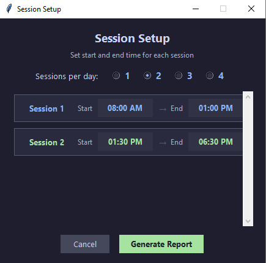
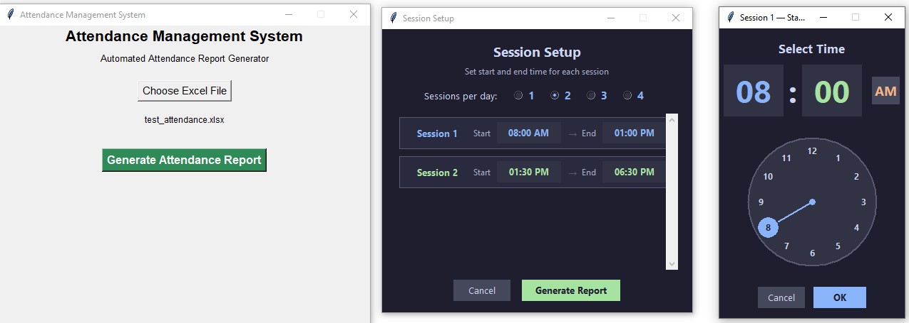
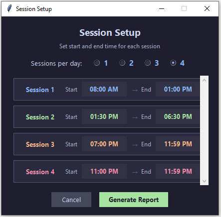
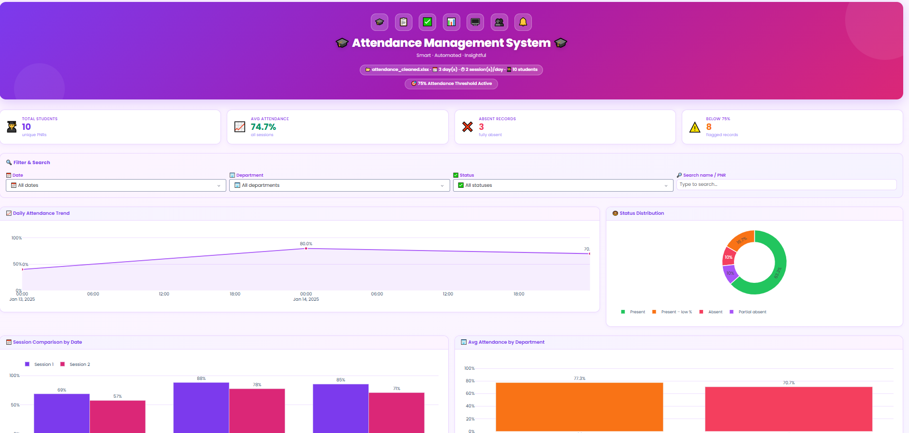

# 🎓 Attendance Management System

> **Automated Attendance Report Generator with an AI-Powered Interactive Dashboard**

A Python desktop application that processes raw Excel-based attendance punch data, generates a formatted multi-sheet Excel report, and automatically launches a beautiful Dash web dashboard for deep analysis — all in one click.

---

## 📸 Screenshots

### 🖥️ Desktop App & Session Setup

<p align="center">
  
  &nbsp;&nbsp;
  
  &nbsp;&nbsp;
  
</p>
<p align="center">
  <em>Main App &nbsp;&nbsp;&nbsp;&nbsp;&nbsp;&nbsp;&nbsp;&nbsp;&nbsp;&nbsp;&nbsp;&nbsp;&nbsp;&nbsp; Session Setup &nbsp;&nbsp;&nbsp;&nbsp;&nbsp;&nbsp;&nbsp;&nbsp;&nbsp;&nbsp;&nbsp;&nbsp;&nbsp;&nbsp; Multi-Session Config</em>
</p>

### 🌐 Live Dashboard

<p align="center">
  
</p>

> Real-time dashboard with KPI cards, daily trend chart, session comparison, department analytics, status donut chart, and more — all filterable and interactive.

---

## ✨ Features

### 🖥️ Desktop GUI (`attendance_app.py`)
- **File picker** — choose any `.xlsx` / `.xls` raw attendance file
- **Session Setup dialog** — configure 1–4 sessions per day with a visual analog clock picker (12-hour format)
- **Smart punch parsing** — auto-classifies each punch timestamp into the correct In / Out slot per session
- **Attendance flags** — detects late entry, early exit, partial absences, and full absences
- **Working time calculation** — computes actual seconds worked per session and overall attendance percentage
- **Formatted Excel output** — writes `attendance_cleaned.xlsx` with:
  - `Attendance_Report` sheet — colour-coded per-date table with session In/Out times and % (highlights < 75% in orange)
  - `Summary_Report` sheet — student-wise P/A grid across all dates with frozen panes and colour coding

### 📊 Web Dashboard (`dashboard.py`)
- **Auto-launched** after report generation, opens at `http://localhost:8050`
- Can also be run **standalone**: `python dashboard.py` or `python dashboard.py path/to/file.xlsx`
- **KPI cards** — Total Students, Avg Attendance %, Absent Records, Below 75% flagged records, Good/Average/Critical counts
- **Interactive filters** — by date, department, attendance status, or free-text name/PNR search with a one-click Reset
- **10+ Plotly charts**:
  - Daily attendance trend + 3-day rolling average line
  - Status donut chart (Present / Present–low % / Absent / Partial absent)
  - Session comparison bar chart by date
  - Department-wise average attendance
  - Student-wise attendance % horizontal bar (click to drill down)
  - Attendance heatmap (Student × Date)
  - Attendance distribution histogram
  - Top 5 / Bottom 5 students
- **Student drill-down** — click any student bar to see their session-wise daily breakdown
- **Actionable Insights panel** — auto-generated intelligence (low-attendance count, weakest session, chronic absentees, best/worst department, overall average)
- **AI Risk Prediction table** — uses linear regression on session percentages to classify each student as 🔴 Critical / 🟠 At Risk / 🟡 Watch / 🟢 Safe
- **CSV export** of the current filtered table view
- **75% attendance threshold** enforced throughout all visualisations and risk logic

---

## 🗂️ Project Structure

```
Attendance_Managemt_Dashboard/
├── attendance_app.py       # Main GUI + processing engine
├── dashboard.py            # Dash web dashboard
├── attendance_logo.png     # (optional) logo shown in the GUI
├── 1.PNG                   # Screenshot - Main App
├── 2.PNG                   # Screenshot - Session Setup
├── 3.PNG                   # Screenshot - Multi-Session Config
├── site.PNG                # Screenshot - Live Dashboard
├── README.md
├── your_raw_data.xlsx      # Your input file (not committed)
└── attendance_cleaned.xlsx # Auto-generated output (not committed)
```

> Keep `attendance_app.py` and `dashboard.py` in the **same folder**.

---

## ⚙️ Prerequisites

- Python **3.8+**
- pip

---

## 📦 Installation

```bash
# 1. Clone the repository
git clone https://github.com/nimbalkarmadhuri/Attendance_Managemt_Dashboard.git
cd Attendance_Managemt_Dashboard

# 2. Install all dependencies
pip install pandas openpyxl pillow dash dash-bootstrap-components plotly psutil
```

---

## 🚀 Usage

### Option A — Full workflow (recommended)

```bash
python attendance_app.py
```

1. Click **"Choose Excel File"** and pick your raw attendance `.xlsx`
2. Click **"Generate Attendance Report"**
3. The **Session Setup** dialog opens — choose 1–4 sessions per day and set their start/end times using the interactive clock picker
4. Click **"Generate Report"**
5. `attendance_cleaned.xlsx` is written next to your input file
6. The dashboard launches automatically and your browser opens at `http://localhost:8050`

### Option B — Dashboard only (if the report already exists)

```bash
python dashboard.py
# or with an explicit path:
python dashboard.py /path/to/attendance_cleaned.xlsx
```

---

## 📥 Input File Format

The application expects a raw Excel file where:
- The first 5 rows are skipped (metadata / headers)
- Each date block begins with a row containing `"Date : <date-value>"`
- Data columns (0-indexed): `Sr No | PNR Number | Name | Department | [unused] | Punch String`
- The **Punch String** column holds comma-separated punch timestamps (e.g. `08:02, 12:58, 13:31, 18:45`)

---

## 📤 Output

| File | Sheet | Description |
|------|-------|-------------|
| `attendance_cleaned.xlsx` | `Attendance_Report` | Per-day, per-student table with In/Out times and session % |
| `attendance_cleaned.xlsx` | `Summary_Report` | Student × Date grid with P/A marks and overall summary |

### Attendance Status Values

| Status | Meaning |
|--------|---------|
| `Present` | All sessions attended on time |
| `Present - Late Entry` | Punched in after the grace window (> 20 min past session start) |
| `Present - Left Early` | Punched out more than 60 min before session end |
| `Present - Late & Left Early` | Both flags raised |
| `Partial Absent (Left After S1)` | Only Session 1 attended, rest absent |
| `Absent in Session{N}_In/Out` | Missing punch for a specific session slot |
| `Absent` | No punches found for the entire day |

---

## 🛠️ Tech Stack

| Layer | Technology |
|-------|-----------|
| Desktop GUI | `tkinter` (built-in) |
| Clock picker | Custom canvas widget (tkinter) |
| Data processing | `pandas`, `openpyxl` |
| Excel output | `openpyxl` with styles & formatting |
| Web dashboard | `Dash`, `Dash Bootstrap Components` |
| Charts | `Plotly` (Graph Objects) |
| AI risk prediction | `numpy` linear regression |
| Image support | `Pillow` (optional — for GUI logo) |
| Process management | `psutil` (optional — auto-kills old dashboard) |

---

## 📝 Notes

- If `attendance_cleaned.xlsx` is open in Excel when you regenerate, a **"Please close the file first"** error will appear — close the file and retry.
- `psutil` is optional. If not installed, old dashboard processes are not auto-killed but the new one still starts fine.
- `Pillow` is optional. If not installed, the logo in the GUI is silently skipped.
- The dashboard reloads data fresh on every filter interaction, so you can regenerate the Excel and simply refresh the browser without restarting the dashboard.

---

## 👤 Author

**Madhuri Nimbalkar**
- GitHub: [@nimbalkarmadhuri](https://github.com/nimbalkarmadhuri)
- Project: [Attendance_Managemt_Dashboard](https://github.com/nimbalkarmadhuri/Attendance_Managemt_Dashboard)

---

## 📄 License

© 2025 Madhuri Nimbalkar. All Rights Reserved.
Unauthorized use, reproduction or distribution is strictly prohibited.

---

> ⭐ If you found this project useful, consider giving it a star on GitHub!